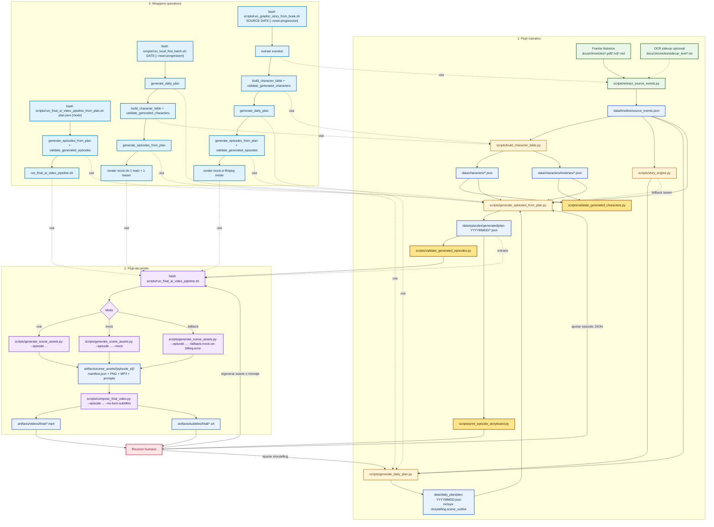

# Arquitectura actual

Este documento describe solo el flujo que existe hoy en el repo. Lo obsoleto o lo que no forma parte del camino real de ejecucion actual queda fuera.

## Diagrama general

## Lectura del diagrama

- Bloque 1: el pipeline narrativo convierte la fuente en `source_events.json`, construye personajes y timelines, genera un `plan` con storytelling por escena y materializa episodios JSON.
- Bloque 2: el pipeline de render toma episodios validados, genera assets por escena y compone el MP4 y el SRT final.
- Bloque 3: los wrappers no introducen logica nueva; solo orquestan tramos del pipeline general para casos de uso concretos.

## Contratos y artefactos

- Timeline normalizado: `data/timeline/source_events.json`
- Estado de progresion: `data/timeline/progression_state.json`
- Personajes: `data/characters/*.json`
- Timelines de personaje: `data/characters/timelines/*.json`
- Plan diario: `data/daily_plan/plan-YYYYMMDD.json`
- Episodios: `data/episodes/generated/plan-YYYYMMDD/*.json`
- Assets por escena: `artifacts/scene_assets/{episode_id}/`
- Videos finales: `artifacts/videos/final/*.mp4`
- Subtitulos finales: `artifacts/subtitles/final/*.srt`

## Dependencias exactas

- `scripts/generate_daily_plan.py` depende de `data/timeline/source_events.json`.
- `scripts/build_character_bible.py` depende de `data/timeline/source_events.json`.
- `scripts/generate_episodes_from_plan.py` depende de:
  - `data/timeline/source_events.json`
  - `data/daily_plan/plan-YYYYMMDD.json`
  - `data/characters/*.json`
  - `data/characters/timelines/*.json`
- `scripts/run_final_ai_video_pipeline_from_plan.sh` ejecuta, en este orden:
  1. `scripts/generate_episodes_from_plan.py`
  2. `scripts/validate_generated_episodes.py`
  3. `scripts/run_final_ai_video_pipeline.sh`
- `scripts/run_final_ai_video_pipeline.sh` ejecuta, por cada episodio:
  1. `scripts/generate_scene_assets.py`
  2. `scripts/compose_final_video.py --no-burn-subtitles`

## Fuera de este documento

No se documentan aqui como parte del flujo actual:

- `n8n`
- `PostgreSQL`
- `Redis`
- `MinIO`
- workflows futuros o no conectados al camino real local-first
