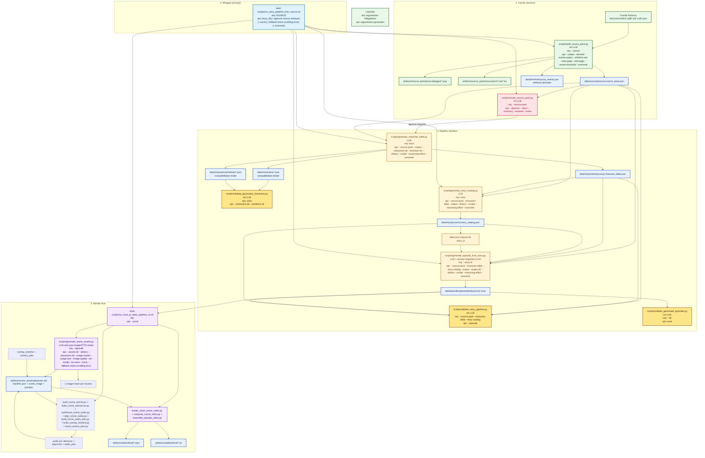

# Arquitectura actual

Este documento describe solo el flujo vigente del repo tras la retirada del pipeline heuristico basado en `daily_plan`.

## Diagrama general

## Lectura del diagrama

- Bloque 1: la fuente canonica se transforma en un `source_pack` con OCR persistido, chunks trazables y un `source_events.json` derivado.
- Bloque 2: el pipeline narrativo solo arranca cuando `source_pack.review.status=approved`; desde ahi genera `character_bible`, `story_catalog` y finalmente el `episode.json` seleccionado. El episodio pasa por una segunda revision lingüistica automatica antes de escribirse en disco. Es la parte principal que usa LLM de texto estructurado.
- Bloque 3: el render sigue consumiendo episodios JSON validados, pero ahora genera una sola imagen base por escena, monta el audio continuo de la escena desde varias fases, ejecuta un analisis visual para obtener foco y regiones protegidas, y compone el video con `text_phases` secuenciales sobre esa misma imagen. Aqui el uso de LLM es opcional en layout y obligatorio solo si no estas en `--mock` para imagen/TTS.
- Bloque 4: el wrapper principal orquesta toda la secuencia y se detiene si falta aprobacion de fuente o seleccion de `story_id`. Importante: `--mock` en este wrapper solo afecta al render final; no mockea `character_bible`, `story_catalog` ni `episode`.

## Warning sobre `--mock`

- `--mock` existe en el render V2: `scripts/run_final_ai_video_pipeline_v2.sh`, `scripts/generate_scene_assets.py`, `scripts/synthesize_scene_audio.py` y `scripts/align_scene_audio.py`.
- `--mock` no existe en `scripts/generate_character_bible.py`, `scripts/generate_story_catalog.py` ni `scripts/generate_episode_from_story.py`.
- Por tanto, `bash scripts/run_story_pipeline_from_source.sh SOURCE ... --mock` sigue haciendo llamadas LLM en la fase narrativa; solo evita las llamadas OpenAI de imagen/TTS/layout del render.

## Uso de LLM por etapa

- `scripts/build_source_pack.py`: no usa LLM. Hace OCR, limpieza y empaquetado de fuente.
- `scripts/review_source_pack.py`: no usa LLM. Es revision/aprobacion humana.
- `scripts/generate_character_bible.py`: usa LLM de texto estructurado.
- `scripts/generate_story_catalog.py`: usa LLM de texto estructurado.
- `scripts/generate_episode_from_story.py`: usa LLM de texto estructurado para generar el episodio y una segunda pasada LLM para corregir ortografia, gramatica, puntuacion y frases incoherentes sin tocar IDs ni trazabilidad.
- `scripts/generate_scene_assets.py`: usa modelos generativos solo en modo real.
  - imagen: LLM multimodal/generativo de imagen
  - voz: TTS
  - en `--mock` no usa LLM
- `scripts/layout_analysis.py`: puede usar LLM multimodal para detectar `focus_target` y `protected_regions`; si falla o estas en `--mock`, cae a heuristica local.
- Los scripts de composicion V2 no usan LLM. Solo FFmpeg y los contratos derivados del render plan.

## Principios operativos del render

- Una escena ya no equivale a una sola caja de texto ni a una sola imagen por bloque.
- La unidad visual es `scene_image_path`: una ilustracion base reutilizada durante toda la escena.
- La unidad temporal visible es `events.json`: un evento por pagina visible ya validada.
- El audio se sintetiza por `utterance` y luego se alinea palabra-audio.
- El `overlay_timeline` y el `camera_plan` son artefactos explicitos.
- Los subtitulos `.srt` se exportan desde tiempos reales del timeline V2.

## Contratos y artefactos

- Fuente canónica revisable: `data/source/{source}.source_pack.json`
- Timeline derivado: `data/timeline/source_events.json`
- Character bible consolidado: `data/characters/{source}.character_bible.json`
- Personajes compatibles con render: `data/characters/*.json`
- Timelines compatibles con render: `data/characters/timelines/*.json`
- Catalogo lineal de historias: `data/story/{source}.story_catalog.json`
- Episodios finales: `data/episodes/generated/{source}/*.json`
- Assets por escena: `artifacts/scene_assets/{episode_id}/`
  - `scene_image_path`: ilustracion base de la escena
  - `text_phases`: paginacion base de salida de `generate_scene_assets.py`
- Render plan V2: `artifacts/render_plan/{episode_id}/`
  - `scene_XX.events.json`
  - `scene_XX.utterances.json`
  - `scene_XX.alignment.json`
  - `scene_XX.audio_plan.json`
  - `scene_XX.overlay_timeline.json`
  - `scene_XX.camera_plan.json`
- Audio por utterance: `artifacts/audio_events/{episode_id}/`
- Videos clean por escena: `artifacts/videos/clean/{episode_id}/`
- Videos compuestos por escena: `artifacts/videos/composited/{episode_id}/`
- Videos finales: `artifacts/videos/final/*.mp4`
- Subtitulos finales: `artifacts/subtitles/final/*.srt`

## Dependencias exactas

- `scripts/build_source_pack.py` depende de la fuente canonica y genera:
  - `data/source/{source}.source_pack.json`
  - `data/timeline/source_events.json`
  - `artifacts/source_pack/{source}/`
- `scripts/review_source_pack.py` actualiza el bloque `review` del `source_pack`.
- `scripts/generate_character_bible.py` depende de:
  - `data/source/{source}.source_pack.json` aprobado
  - OpenAI API
  - LLM de texto estructurado
  - no tiene `--mock`
- `scripts/generate_story_catalog.py` depende de:
  - `data/source/{source}.source_pack.json` aprobado
  - `data/characters/{source}.character_bible.json`
  - OpenAI API
  - LLM de texto estructurado
  - no tiene `--mock`
- `scripts/generate_episode_from_story.py` depende de:
  - `data/source/{source}.source_pack.json` aprobado
  - `data/characters/{source}.character_bible.json`
  - `data/story/{source}.story_catalog.json`
  - un `story_id` valido
  - OpenAI API
  - LLM de texto estructurado
  - revision linguistica automatica del texto final (`OPENAI_EPISODE_REVIEW_MODEL` opcional; por defecto reutiliza el modelo de episodio, `OPENAI_EPISODE_REVIEW_REASONING_EFFORT` opcional con default `low`, y `OPENAI_EPISODE_REVIEW_SCOPE=full|render`)
  - no tiene `--mock`
- `scripts/generate_scene_assets.py` depende de:
  - `data/episodes/generated/{source}/*.json`
  - OpenAI Images API o `--mock`
  - OpenAI TTS API o `--mock`
  - opcionalmente `OPENAI_LAYOUT_MODEL` para analisis visual posterior
- `scripts/layout_analysis.py` depende de:
  - `scene_image_path`
  - metadata de escena y `text_phases`
  - OpenAI Responses API multimodal o fallback heuristico
- `scripts/run_final_ai_video_pipeline_v2.sh` ejecuta, por cada episodio:
  1. `scripts/generate_scene_assets.py`
  2. `scripts/build_scene_events.py`
  3. `scripts/build_scene_utterances.py`
  4. `scripts/synthesize_scene_audio.py`
  5. `scripts/align_scene_audio.py`
  6. `scripts/build_scene_audio_plan.py`
  7. `scripts/render_clean_scene_video.py`
  8. `scripts/build_overlay_timeline.py`
  9. `scripts/build_camera_plan.py`
  10. `scripts/compose_scene_video.py`
  11. `scripts/assemble_episode_video.py`

## Orden interno del render por escena

1. `generate_scene_assets.py` genera una imagen base por escena y la paginacion visible base.
2. `events` y `utterances` convierten esa salida en unidades canonicas de render.
3. El audio se genera por `utterance` y se alinea palabra-audio.
4. `audio_plan` resuelve la duracion real de la escena.
5. `render_clean_scene_video.py` crea un `scene.clean.mp4` continuo.
6. `build_overlay_timeline.py` coloca overlays con respiracion y micro-crossfade tecnico.
7. `build_camera_plan.py` calcula el zoom final sobre el frame ya compuesto.
8. `compose_scene_video.py` genera `scene.composited.mp4`.
9. `assemble_episode_video.py` concatena escenas y escribe el `.srt`.

## Fuera de este documento

No se documentan aqui como parte del flujo local vigente:

- n8n como orquestador principal
- PostgreSQL
- Redis
- MinIO
- workflows legacy no conectados al pipeline fuente-first
