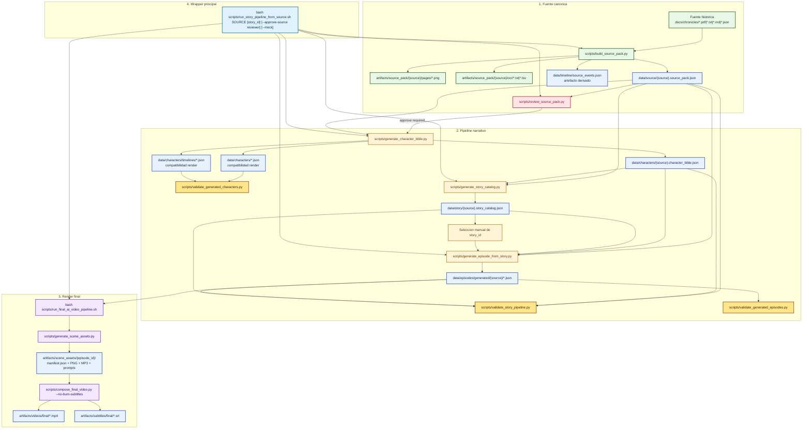

# Arquitectura actual

Este documento describe solo el flujo vigente del repo tras la retirada del pipeline heuristico basado en `daily_plan`.

## Diagrama general

## Lectura del diagrama

- Bloque 1: la fuente canonica se transforma en un `source_pack` con OCR persistido, chunks trazables y un `source_events.json` derivado.
- Bloque 2: el pipeline narrativo solo arranca cuando `source_pack.review.status=approved`; desde ahi genera `character_bible`, `story_catalog` y finalmente el `episode.json` seleccionado.
- Bloque 3: el render sigue consumiendo episodios JSON validados y genera assets, subtitulos y MP4.
- Bloque 4: el wrapper principal orquesta toda la secuencia y se detiene si falta aprobacion de fuente o seleccion de `story_id`.

## Contratos y artefactos

- Fuente canónica revisable: `data/source/{source}.source_pack.json`
- Timeline derivado: `data/timeline/source_events.json`
- Character bible consolidado: `data/characters/{source}.character_bible.json`
- Personajes compatibles con render: `data/characters/*.json`
- Timelines compatibles con render: `data/characters/timelines/*.json`
- Catalogo lineal de historias: `data/story/{source}.story_catalog.json`
- Episodios finales: `data/episodes/generated/{source}/*.json`
- Assets por escena: `artifacts/scene_assets/{episode_id}/`
- Videos finales: `artifacts/videos/final/*.mp4`
- Subtitulos finales: `artifacts/subtitles/final/*.srt`

## Dependencias exactas

- `scripts/build_source_pack.py` depende de la fuente canonica y genera:
  - `data/source/{source}.source_pack.json`
  - `data/timeline/source_events.json`
  - `artifacts/source_pack/{source}/`
- `scripts/review_source_pack.py` actualiza el bloque `review` del `source_pack`.
- `scripts/generate_character_bible.py` depende de:
  - `data/source/{source}.source_pack.json` aprobado
  - OpenAI API
- `scripts/generate_story_catalog.py` depende de:
  - `data/source/{source}.source_pack.json` aprobado
  - `data/characters/{source}.character_bible.json`
  - OpenAI API
- `scripts/generate_episode_from_story.py` depende de:
  - `data/source/{source}.source_pack.json` aprobado
  - `data/characters/{source}.character_bible.json`
  - `data/story/{source}.story_catalog.json`
  - un `story_id` valido
  - OpenAI API
- `scripts/run_final_ai_video_pipeline.sh` ejecuta, por cada episodio:
  1. `scripts/generate_scene_assets.py`
  2. `scripts/compose_final_video.py --no-burn-subtitles`

## Fuera de este documento

No se documentan aqui como parte del flujo local vigente:

- n8n como orquestador principal
- PostgreSQL
- Redis
- MinIO
- workflows legacy no conectados al pipeline fuente-first
